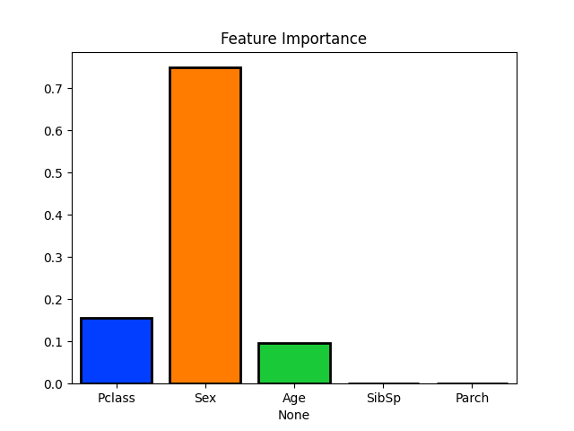

# Titanic Survival Prediction with Decision Trees

The project involves preparing and cleaning the Titanic dataset, building a decision tree classification model, and evaluating its performance. We will also determine the importance of different features in predicting survival. The key insights are highlighted in the conclusion.

## Table of Contents
- [Introduction](#intro)
- [Loading and Inspecting the Data](#load)
- [Data Preprocessing](#pre)
- [Splitting the Data](#split)
- [Building the Decision Tree Model](#tree)
- [Model Evaluation](#model)
- [Feature Importance Analysis and Evaluation](#feature)
- [Conclusion](#conclusion)

## [Introduction](#intro)

In this project, we'll explore a dataset related to the Titanic, focusing on predicting survival outcomes based on several features such as passenger class, age, gender, and more. We will build a decision tree classification model to make these predictions. The project aims to understand the importance of various features in determining the survival of passengers aboard the Titanic.

## [Loading and Inspecting the Data](#load)

In this step, we load the Titanic dataset and examine the first few rows to get an overview of the data. Understanding the dataset is crucial for data preprocessing and modeling.

```python
import pandas as pd

df = pd.read_csv('titanic.csv', sep=',')

df.head(5)
```

## [Data Preprocessing](#pre)

In this step, we perform data preprocessing by dropping unnecessary columns, renaming columns for clarity, and one-hot encoding the 'Sex' feature. These transformations prepare the data for modeling.

```python
columns_to_drop = ['Name', 'Fare']
df.drop(columns=columns_to_drop, axis='columns', inplace=True)

df.columns = ['Survived', 'Pclass', 'Sex', 'Age', 'SibSp', 'Parch']
print(df.shape)
print(df.dtypes)

df = pd.get_dummies(df, columns=['Sex'], drop_first=True)
df.rename(columns={'Sex_male': 'Sex'}, inplace=True)

df = df[['Survived', 'Pclass', 'Sex', 'Age', 'SibSp', 'Parch']]
```

## [Splitting the Data](#split)

We split the data into training and testing sets to train our model on one subset and evaluate its performance on another. This helps us avoid overfitting and ensures our model's generalization capability.

```python
X = df.drop('Survived', axis=1)
y = df['Survived']

X_train, X_test, y_train, y_test = train_test_split(X, y, test_size=0.3, random_state=00000)
```

## [Building the Decision Tree Model](#tree)

In this step, we create a decision tree classification model. We specify a maximum depth for the tree to avoid overfitting. The model is trained on the training data.

```python
tree = DecisionTreeClassifier(max_depth=2, random_state=00000)
tree.fit(X_train, y_train)
```

## [Model Evaluation](#model)

We evaluate the model's performance using accuracy metrics for both the training and testing datasets. This allows us to assess how well the model generalizes to unseen data.

```python
train_prediction = tree.predict(X_train)
test_prediction = tree.predict(X_test)

train_accuracy = accuracy_score(y_train, train_prediction)
test_accuracy = accuracy_score(y_test, test_prediction)

print('Training Accuracy:', train_accuracy)
print('Test Accuracy:', test_accuracy)
```


## [Feature Importance Analysis and Evaluation](#feature)

In this step, we analyze the importance of different features in making survival predictions. The feature importance is visualized as a barplot, helping us understand which features have the most impact on the model's decisions.

```python
importances = tree.feature_importances_
columns = X.columns

sns.barplot(y=importances, x=columns, palette='bright', saturation=2.0, edgecolor='black', linewidth=2)
plt.title('Feature Importance')
plt.show()
```



## [Conclusion](#conclusion)

From the analysis, we can conclude that the most important features for predicting survival are 'Sex', followed by 'Pclass' and 'Age'. We also observed a positive performance for our model as indicated by the Accuracy metric for both the training and testing datasets.